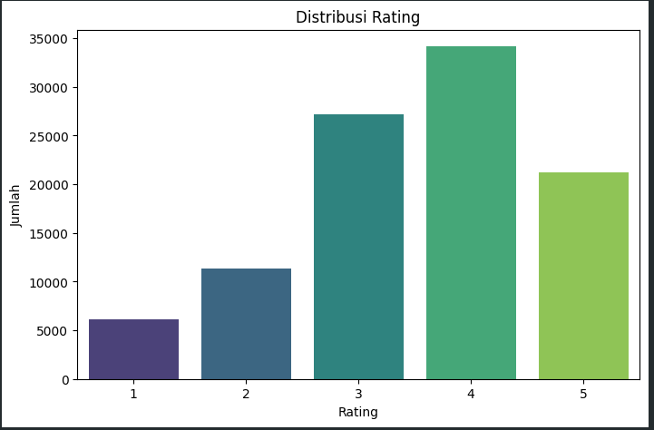
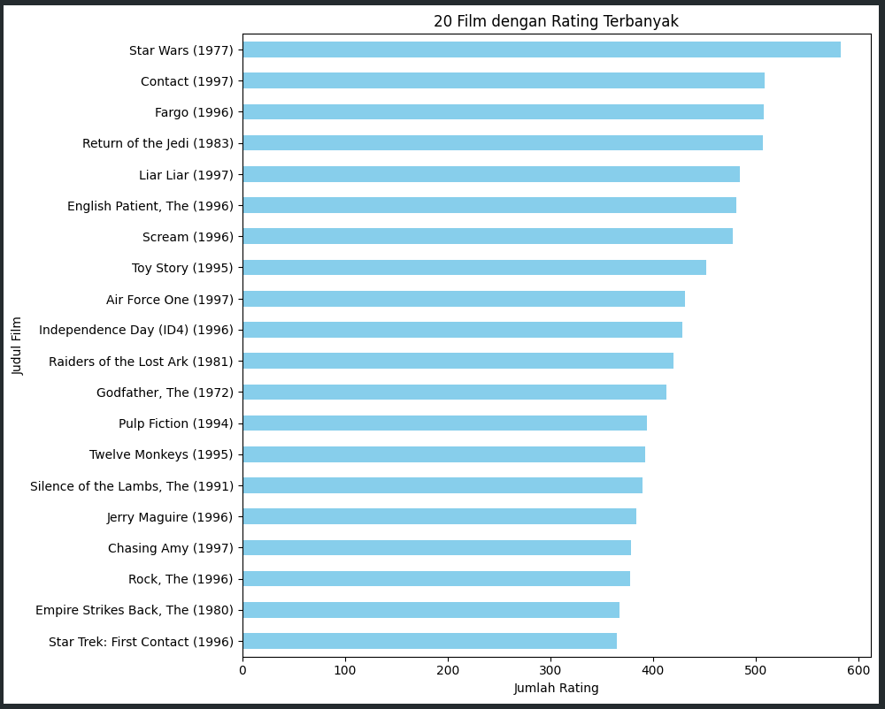
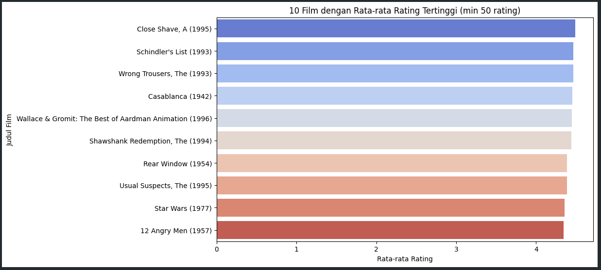
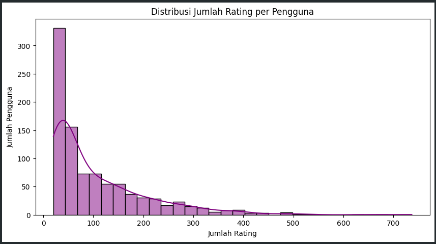
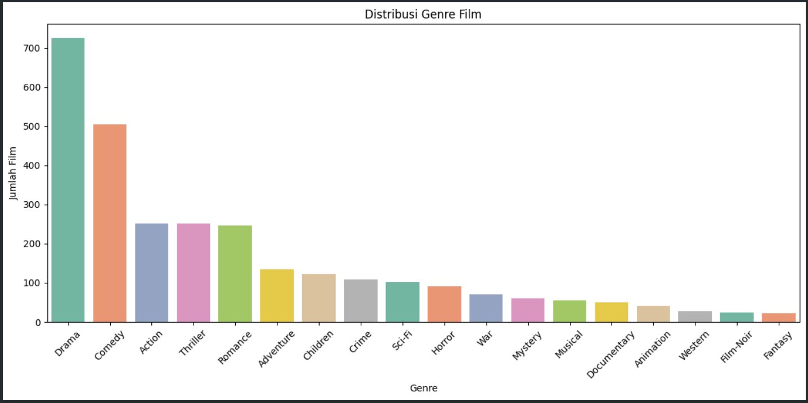
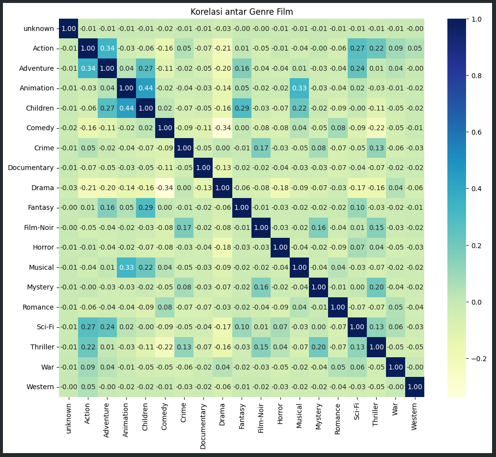

# Laporan Proyek Machine Learning - Sistem Rekomendasi Film

## Project Overview

Industri entertainment digital mengalami pertumbuhan pesat dengan jutaan konten film tersedia di platform streaming. Pengguna sering mengalami information overload yang menyulitkan mereka menemukan film sesuai preferensi. Sistem rekomendasi menjadi solusi krusial untuk meningkatkan user experience dan engagement.

Netflix melaporkan bahwa 80% konten yang ditonton berasal dari sistem rekomendasi mereka [1]. McKinsey Global Institute menunjukkan bahwa sistem rekomendasi berkontribusi hingga 35% dari total pendapatan Amazon dan 75% dari waktu menonton Netflix [2]. Hal ini menunjukkan pentingnya teknologi rekomendasi dalam industri digital.

Masalah ini harus diselesaikan karena:
- Meningkatkan kepuasan dan retensi pengguna
- Mengoptimalkan discovery konten yang relevan
- Meningkatkan monetisasi platform streaming
- Mengurangi churn rate akibat kesulitan menemukan konten

**Referensi:**

[1] C. A. Gomez-Uribe and N. Hunt, "The netflix recommender system: Algorithms, business value, and innovation," ACM Transactions on Management Information Systems, vol. 6, no. 4, pp. 1-19, 2015. https://dl.acm.org/doi/10.1145/2843948

[2] J. Manyika et al., "The age of analytics: Competing in a data-driven world," McKinsey Global Institute, 2016. https://www.mckinsey.com/capabilities/quantumblack/our-insights/the-age-of-analytics-competing-in-a-data-driven-world

## Business Understanding

### Problem Statements

- Bagaimana memberikan rekomendasi film yang sesuai dengan preferensi pengguna berdasarkan karakteristik konten film?
- Bagaimana memberikan rekomendasi film berdasarkan pola rating dan preferensi pengguna lain yang memiliki kesamaan selera?
- Bagaimana mengukur efektivitas sistem rekomendasi yang telah dibuat?

### Goals

- Mengembangkan sistem rekomendasi content-based filtering yang dapat merekomendasikan film berdasarkan genre dan karakteristik film
- Mengembangkan sistem rekomendasi collaborative filtering yang dapat merekomendasikan film berdasarkan pola rating pengguna dengan preferensi serupa
- Mengevaluasi performa kedua sistem menggunakan metrik evaluasi yang tepat

### Solution Statements

- **Content-Based Filtering**: Menggunakan TF-IDF Vectorizer untuk menganalisis genre film dan menghitung cosine similarity untuk menemukan film dengan karakteristik serupa
- **Collaborative Filtering**: Menggunakan matrix factorization dengan Singular Value Decomposition (SVD) untuk memprediksi rating dan memberikan rekomendasi berdasarkan pola preferensi pengguna

## Data Understanding

Dataset yang digunakan adalah MovieLens 100K Dataset yang dapat diunduh dari [GroupLens Research](https://grouplens.org/datasets/movielens/100k/). Dataset ini berisi 100,000 rating dari 943 pengguna untuk 1,682 film, dikumpulkan oleh GroupLens Research Project di University of Minnesota.

Dataset terdiri dari dua file utama:
- **u.data**: File ratings dengan 100,000 baris data
- **u.item**: File informasi film dengan 1,682 baris data

Variabel-variabel pada dataset adalah sebagai berikut:

**File u.data (ratings):**
- user_id: Identitas unik pengguna
- item_id: Identitas unik film
- rating: Rating yang diberikan pengguna
- timestamp: Waktu pemberian rating

**File u.item (movies):**
- movie_id: Identitas unik film
- title: Judul film beserta tahun rilis
- release_date: Tanggal rilis film
- video_release_date: Tanggal rilis video
- imdb_url: URL IMDb film
- 19 kolom genre: Binary indicator (0/1) untuk genre seperti Action, Adventure, Animation, Children, Comedy, Crime, Documentary, Drama, Fantasy, Film-Noir, Horror, Musical, Mystery, Romance, Sci-Fi, Thriller, War, Western

### Exploratory Data Analysis

Berdasarkan visualisasi distribusi rating, dapat dilihat bahwa rating terbanyak berada pada skala 4, diikuti oleh skala 3 dan 5. Rating dengan skala 1 dan 2 memiliki jumlah yang lebih sedikit.

Berdasarkan data rating, film "Star Wars (1977)" menjadi film dengan jumlah rating terbanyak, diikuti oleh "Contact (1997)" dan "Fargo (1996)".

Berdasarkan rata-rata rating dengan minimal 50 rating, film "Close Shave, A (1995)" menduduki peringkat teratas, diikuti oleh film-film klasik seperti "Schindler's List (1993)", Wrong Trouesers (1993) dan Casablanca (1942).

Visualisasi distribusi jumlah rating per pengguna menunjukkan bahwa sebagian besar pengguna memberikan rating dalam jumlah yang relatif kecil, dengan penurunan jumlah pengguna seiring dengan bertambahnya jumlah rating yang mereka berikan. Distribusi ini cenderung miring ke kanan (right-skewed).

Berdasarkan visualisasi distribusi genre film, genre "Drama" memiliki jumlah film terbanyak, diikuti oleh "Comedy" dan "Action". Beberapa genre seperti "Fantasy" dan "unknown" memiliki jumlah film yang paling sedikit dalam dataset ini.

Visualisasi korelasi antar genre film menunjukkan beberapa korelasi positif dan negatif. Contohnya, terdapat korelasi positif antara genre "Action" dan "Sci-Fi", serta antara "Animation" dan "Children". Sebaliknya, beberapa genre menunjukkan korelasi negatif yang lemah. Matriks korelasi ini memberikan gambaran tentang bagaimana kemunculan suatu genre dapat berhubungan dengan kemunculan genre lainnya dalam film.

## Data Preparation

Teknik data preparation yang diterapkan:

1.  **Feature Engineering untuk Content-Based**
    - Membuat kolom 'genre_string' dengan menggabungkan semua genre aktif untuk setiap film dalam format teks.
    - **Transformasi 'genre_string' menggunakan TF-IDF Vectorizer** untuk menghasilkan representasi vektor numerik dari fitur genre film. Vektor ini akan digunakan untuk menghitung kesamaan antar film.

2.  **Data Splitting**
    - Membagi dataset `ratings` menjadi data latih (`train_data`) dan data uji (`test_data`) dengan proporsi 80:20. Pemisahan ini bertujuan untuk evaluasi model yang objektif. Stratified split tidak secara eksplisit disebutkan dilakukan berdasarkan distribusi rating di kode, namun `random_state` digunakan untuk reproduktifitas.

3.  **Matrix Preparation untuk Collaborative Filtering**
    - Membuat `user_item_matrix` dari keseluruhan data `ratings` (digunakan untuk melatih model SVD). Nilai yang hilang (film yang belum dirating) diisi dengan 0.
    - Membuat `train_user_item_matrix` dari `train_data` (digunakan dalam fungsi rekomendasi untuk filtering dan berpotensi untuk melatih model jika SVD dilatih hanya pada data training).
    - Membuat `test_user_item_matrix` dari `test_data` (digunakan untuk evaluasi performa model Collaborative Filtering).
    - Normalisasi rating tidak dilakukan secara eksplisit karena SVD sebagai teknik faktorisasi matriks dapat menangani data sparse secara inheren.

Tahapan preparation ini diperlukan untuk memastikan data siap diproses oleh algoritma machine learning, menangani sparsity, menyiapkan fitur yang relevan, dan memungkinkan evaluasi yang valid.

## Modeling

### Content-Based Filtering

Algoritma yang digunakan adalah kombinasi TF-IDF Vectorizer (dari tahap Data Preparation) dan Cosine Similarity.

**Proses modeling:**
1.  Menggunakan matriks TF-IDF dari genre film yang telah dibuat pada tahap Data Preparation.
2.  Menghitung matriks `cosine_similarity` antar semua film berdasarkan vektor TF-IDF genre mereka.
3.  Untuk film input, sistem akan mengambil N film teratas dengan skor cosine similarity tertinggi sebagai rekomendasi.

**Hasil Top-5 Rekomendasi untuk "Toy Story (1995)":**
1.  Aladdin and the King of Thieves (1996) - Similarity: 1.000
2.  Aristocats, The (1970) - Similarity: 0.937
3.  Pinocchio (1940) - Similarity: 0.937
4.  Sword in the Stone, The (1963) - Similarity: 0.937
5.  Fox and the Hound, The (1981)) - Similarity: 0.937

### Collaborative Filtering

Algoritma yang digunakan adalah Matrix Factorization dengan SVD (Singular Value Decomposition).

**Proses modeling:**
1.  Melakukan dekomposisi `user_item_matrix` (yang dibuat dari keseluruhan data rating) menggunakan TruncatedSVD dengan 50 komponen untuk mendapatkan faktor pengguna dan faktor item.
2.  Melakukan rekonstruksi matriks rating dengan mengalikan faktor pengguna dan faktor item untuk mendapatkan prediksi rating untuk semua pasangan user-item.
3.  Untuk pengguna tertentu, sistem akan merekomendasikan item-item yang belum pernah dirating oleh pengguna tersebut, diurutkan berdasarkan prediksi rating tertinggi.

**Hasil Top-5 Rekomendasi untuk User ID 1:**
1.  Fargo (1996) - Predicted Rating: 6.40
2.  Toy Story (1995) - Predicted Rating: 5.11
3.  Blues Brothers, The (1980) -Predicted Rating: 4.63
4.  Fish Called Wanda, A (1988) - Predicted Rating: 4.56
5.  Reservoir Dogs (1992) - Predicted Rating: 4.39

### Kelebihan dan Kekurangan

**Content-Based Filtering:**
-   Kelebihan: Tidak ada cold start problem untuk item baru (selama item memiliki fitur konten), rekomendasi transparan dan explainable, tidak memerlukan data rating dari pengguna lain.
-   Kekurangan: Keterbatasan diversitas (cenderung merekomendasikan item yang sangat mirip), potensi over-specialization, sangat bergantung pada kualitas dan kelengkapan fitur konten yang diekstrak.

**Collaborative Filtering:**
-   Kelebihan: Mampu menemukan pola preferensi yang kompleks dan item yang mengejutkan (serendipity), dapat menghasilkan rekomendasi yang lebih beragam, tidak bergantung pada fitur konten item.
-   Kekurangan: Mengalami cold start problem untuk pengguna baru dan item baru (yang belum memiliki interaksi), membutuhkan data rating yang substansial untuk performa yang baik, sparsity data bisa menjadi masalah, potensi kompleksitas komputasi yang tinggi pada dataset besar.

## Evaluation

### Metrik Evaluasi

Metrik evaluasi yang digunakan untuk mengukur performa sistem rekomendasi:

1.  **Root Mean Square Error (RMSE)** - *Untuk Collaborative Filtering*
    -   **Formula**: $RMSE = \sqrt{\frac{1}{n} \sum_{i=1}^{n} (predicted_i - actual_i)^2}$
    -   Mengukur akurasi prediksi rating dengan menghitung akar kuadrat dari rata-rata kuadrat selisih antara nilai prediksi dan nilai aktual pada data uji.
    -   Semakin kecil nilai RMSE, semakin baik akurasi prediksi model.

2.  **Mean Absolute Error (MAE)** - *Untuk Collaborative Filtering*
    -   **Formula**: $MAE = \frac{1}{n} \sum_{i=1}^{n} |predicted_i - actual_i|$
    -   Mengukur rata-rata absolut dari selisih antara nilai prediksi dan nilai aktual pada data uji.
    -   Semakin kecil nilai MAE, semakin akurat prediksi model.

3.  **Precision@k (Precision at K)** - *Untuk Collaborative Filtering*
    -   **Formula**: $Precision@k = \frac{\text{Jumlah item relevan pada top-k}}{\text{k}}$
    -   Menilai seberapa banyak item yang direkomendasikan dalam top-k yang benar-benar relevan bagi pengguna (item yang relevan didefinisikan sebagai item yang diberi rating tinggi, misal >= 4, oleh pengguna di data uji).
    -   Contoh: Precision@5 mengukur proporsi item relevan dari 5 item teratas yang direkomendasikan.

4.  **Coverage** - *Dapat diterapkan pada kedua jenis model*
    -   **Formula**: $Coverage = \frac{\text{Jumlah item unik yang dapat direkomendasikan}}{\text{Total item unik dalam katalog}} \times 100\%$
    -   Mengukur seberapa besar proporsi item dalam katalog yang dapat direkomendasikan oleh sistem.
    -   Semakin tinggi coverage, semakin beragam item yang berpotensi untuk direkomendasikan. (Pada implementasi saat ini, 'Coverage Content-Based' yang dilaporkan adalah persentase keberhasilan fungsi dalam menghasilkan rekomendasi dari sampel judul film yang diuji, bukan coverage katalog).

**Catatan untuk Evaluasi Content-Based Filtering:**
Metrik seperti **Mean Similarity** (rata-rata skor cosine similarity dari item yang direkomendasikan) dapat memberikan gambaran tentang seberapa mirip rekomendasi dengan item input berdasarkan konten. Namun, ini lebih merupakan ukuran karakteristik daripada metrik performa prediktif. Untuk evaluasi performa yang lebih standar, metrik seperti **Precision@k, Recall@k, atau F1-score@k** akan lebih sesuai, namun ini memerlukan pendefinisian "item relevan" untuk setiap item uji dalam konteks content-based, yang bisa jadi kompleks (misalnya, berdasarkan kesamaan genre yang sangat spesifik atau data interaksi pengguna lain yang memvalidasi kesamaan tersebut).

### Hasil Evaluasi

-   RMSE Collaborative                             : 1.850
-   MAE Collaborative                              : 1.536
-   Precision@5 Collaborative                      : 0.175
-   Content-Based Mean Similarity (karakteristik)  : 0.982
-   Coverage (fungsi Content-Based pada sampel uji): 100.0%

**Interpretasi Hasil:**
-   Nilai Root Mean Squared Error (RMSE) untuk model collaborative filtering (SVD) adalah 1.850. Metrik ini mengukur rata-rata magnitudo kesalahan prediksi rating. Dalam konteks skala rating 1-5, ini menunjukkan bahwa, secara rata-rata, prediksi rating yang diberikan oleh model SVD memiliki selisih sekitar 1.85 poin dari rating aktual yang diberikan oleh pengguna. Semakin rendah nilai RMSE, semakin akurat model dalam memprediksi rating.
-   Mean Absolute Error (MAE) sebesar 1.536 juga mengukur rata-rata kesalahan prediksi rating. Berbeda dengan RMSE yang memberikan bobot lebih pada kesalahan besar, MAE menghitung rata-rata selisih absolut. Nilai ini mengindikasikan bahwa, rata-rata, prediksi rating menyimpang sekitar 1.54 poin dari rating sebenarnya. Nilai ini sedikit lebih rendah dari RMSE, yang mungkin menunjukkan adanya beberapa prediksi dengan kesalahan yang cukup besar yang lebih dipenalti oleh RMSE.
-   Precision@5 untuk model collaborative filtering adalah 0.175. Metrik ini mengevaluasi seberapa relevan 5 item teratas yang direkomendasikan kepada pengguna. Nilai 0.175 berarti bahwa, rata-rata, sekitar 17.5% dari 5 film yang direkomendasikan adalah film yang memang dianggap relevan oleh pengguna di set pengujian (dalam kasus ini, film dengan rating aktual >= 4.0). Ini menunjukkan bahwa ada ruang untuk peningkatan dalam hal ketepatan rekomendasi pada daftar teratas.
-   Untuk model content-based filtering, rata-rata skor similaritas (berdasarkan genre dengan TF-IDF dan Cosine Similarity) dari item-item yang direkomendasikan terhadap film input adalah 0.982. Skor yang sangat tinggi ini (mendekati 1.0) menunjukkan bahwa model berhasil menemukan dan merekomendasikan film-film yang memiliki profil genre yang sangat mirip dengan film yang dijadikan acuan. Hal ini sesuai dengan tujuan dari content-based filtering, yaitu merekomendasikan berdasarkan kesamaan atribut.
-   Cakupan sebesar 100.0% untuk fungsi content-based (berdasarkan sampel uji yang digunakan dalam evaluasi) menunjukkan bahwa untuk semua film yang diuji dalam sampel tersebut, model mampu menghasilkan daftar rekomendasi. Ini mengindikasikan bahwa fungsi rekomendasi content-based cukup robust dan dapat memberikan hasil untuk berbagai input film (dalam batasan sampel yang diuji dan ketersediaan genre).

Secara keseluruhan, model collaborative filtering (SVD) menunjukkan kemampuan untuk memprediksi rating dengan tingkat kesalahan yang terukur oleh RMSE dan MAE. Namun, Precision@5 mengindikasikan bahwa akurasi dalam menyajikan item yang paling relevan di posisi teratas masih bisa ditingkatkan. Di sisi lain, model content-based sangat efektif dalam menemukan item yang serupa secara konten (genre), sebagaimana ditunjukkan oleh skor similaritas yang tinggi dan cakupan yang baik pada sampel uji.