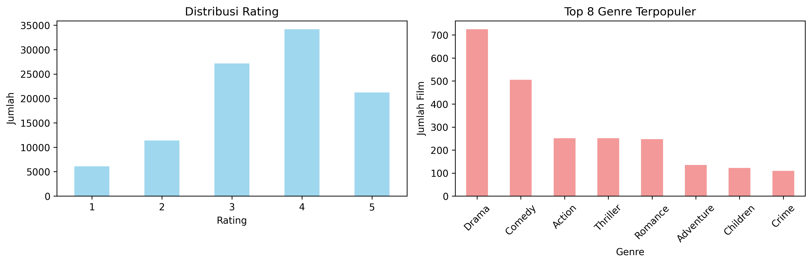

# Laporan Proyek Machine Learning - Sistem Rekomendasi Film

## Project Overview

Industri entertainment digital mengalami pertumbuhan pesat dengan jutaan konten film tersedia di platform streaming. Pengguna sering mengalami information overload yang menyulitkan mereka menemukan film sesuai preferensi. Sistem rekomendasi menjadi solusi krusial untuk meningkatkan user experience dan engagement.

Netflix melaporkan bahwa 80% konten yang ditonton berasal dari sistem rekomendasi mereka [1]. McKinsey Global Institute menunjukkan bahwa sistem rekomendasi berkontribusi hingga 35% dari total pendapatan Amazon dan 75% dari waktu menonton Netflix [2]. Hal ini menunjukkan pentingnya teknologi rekomendasi dalam industri digital.

Masalah ini harus diselesaikan karena:
- Meningkatkan kepuasan dan retensi pengguna
- Mengoptimalkan discovery konten yang relevan
- Meningkatkan monetisasi platform streaming
- Mengurangi churn rate akibat kesulitan menemukan konten

**Referensi:**
[1] C. A. Gomez-Uribe and N. Hunt, "The netflix recommender system: Algorithms, business value, and innovation," ACM Transactions on Management Information Systems, vol. 6, no. 4, pp. 1-19, 2015. [https://dl.acm.org/doi/10.1145/2843948]

[2] J. Manyika et al., "The age of analytics: Competing in a data-driven world," McKinsey Global Institute, 2016. [https://www.mckinsey.com/~/media/mckinsey/industries/public%20and%20social%20sector/our%20insights/the%20age%20of%20analytics%20competing%20in%20a%20data%20driven%20world/mgi-the-age-of-analytics-full-report.pdf]

## Business Understanding

### Problem Statements

- Bagaimana memberikan rekomendasi film yang sesuai dengan preferensi pengguna berdasarkan karakteristik konten film?
- Bagaimana memberikan rekomendasi film berdasarkan pola rating dan preferensi pengguna lain yang memiliki kesamaan selera?
- Bagaimana mengukur efektivitas sistem rekomendasi yang telah dibuat?

### Goals

- Mengembangkan sistem rekomendasi content-based filtering yang dapat merekomendasikan film berdasarkan genre dan karakteristik film
- Mengembangkan sistem rekomendasi collaborative filtering yang dapat merekomendasikan film berdasarkan pola rating pengguna dengan preferensi serupa
- Mengevaluasi performa kedua sistem menggunakan metrik evaluasi yang tepat

### Solution Statements

- **Content-Based Filtering**: Menggunakan TF-IDF Vectorizer untuk menganalisis genre film dan menghitung cosine similarity untuk menemukan film dengan karakteristik serupa
- **Collaborative Filtering**: Menggunakan matrix factorization dengan Singular Value Decomposition (SVD) untuk memprediksi rating dan memberikan rekomendasi berdasarkan pola preferensi pengguna

## Data Understanding

Dataset yang digunakan adalah MovieLens 100K Dataset yang dapat diunduh dari [GroupLens Research](https://grouplens.org/datasets/movielens/100k/). Dataset ini berisi 100,000 rating dari 943 pengguna untuk 1,682 film, dikumpulkan oleh GroupLens Research Project di University of Minnesota.

Dataset terdiri dari dua file utama:
- **u.data**: File ratings dengan 100,000 baris data
- **u.item**: File informasi film dengan 1,682 baris data

Variabel-variabel pada dataset adalah sebagai berikut:

**File u.data (ratings):**
- user_id: Identitas unik pengguna (1-943)
- item_id: Identitas unik film (1-1682)  
- rating: Rating yang diberikan pengguna (skala 1-5)
- timestamp: Waktu pemberian rating (Unix timestamp)

**File u.item (movies):**
- movie_id: Identitas unik film (1-1682)
- title: Judul film beserta tahun rilis
- release_date: Tanggal rilis film
- video_release_date: Tanggal rilis video
- imdb_url: URL IMDb film
- 19 kolom genre: Binary indicator (0/1) untuk genre seperti Action, Adventure, Animation, Children, Comedy, Crime, Documentary, Drama, Fantasy, Film-Noir, Horror, Musical, Mystery, Romance, Sci-Fi, Thriller, War, Western

### Exploratory Data Analysis

Analisis data menunjukkan:
- Distribusi rating: Rating 4 paling banyak (34,2%), diikuti rating 3 (27,1%) dan 5 (21,2%)
- Genre terpopuler: Drama (725 film), Comedy (505 film), Action (251 film)
- Sparsity matrix user-item sangat tinggi (~93.7%), menunjukkan tantangan cold start problem
- Rata-rata rating per pengguna: 106 rating, dengan variasi dari 20 hingga 737 rating



## Data Preparation

Teknik data preparation yang diterapkan:

1. **Data Loading dan Integration**
   - Memuat data dari file terpisah menggunakan pandas dengan encoding latin-1
   - Menggabungkan data ratings dengan informasi film untuk analisis komprehensif

2. **Data Cleaning**
   - Validasi konsistensi ID pengguna dan film
   - Penanganan missing values (tidak ditemukan missing values signifikan)

3. **Feature Engineering untuk Content-Based**
   - Membuat kolom 'genre_string' dengan menggabungkan semua genre aktif untuk setiap film
   - Transformasi binary genre indicators menjadi text format untuk TF-IDF processing

4. **Matrix Preparation untuk Collaborative Filtering**
   - Membuat user-item matrix dengan pivot table
   - Mengisi missing values dengan 0 untuk film yang belum dirating
   - Normalisasi tidak diperlukan karena SVD dapat menangani sparse matrix

5. **Data Splitting**
   - Membagi data menjadi train-test (80:20) untuk evaluasi objektif
   - Stratified split berdasarkan distribusi rating

Tahapan preparation diperlukan untuk memastikan data siap diproses oleh algoritma machine learning, menangani sparsity issue, dan memungkinkan evaluasi yang valid.

## Modeling

### Content-Based Filtering

Algoritma yang digunakan adalah TF-IDF Vectorizer kombinasi dengan Cosine Similarity.

**Proses modeling:**
1. Transformasi genre string menggunakan TF-IDF untuk menghasilkan vektor numerik
2. Perhitungan cosine similarity antar film berdasarkan vektor genre
3. Ranking film berdasarkan similarity score tertinggi

**Hasil Top-5 Rekomendasi untuk "Toy Story (1995)":**
1. Aladdin and the King of Thieves (1996) - Similarity: 1.000
2. Aristocats, The (1970) - Similarity: 0.937
3. Pinocchio (1940) - Similarity: 0.937
4. Sword in the Stone, The (1963) - Similarity: 0.937
5. Fox and the Hound, The (1981)) - Similarity: 0.937

### Collaborative Filtering

Algoritma yang digunakan adalah Matrix Factorization dengan SVD (Singular Value Decomposition).

**Proses modeling:**
1. Dekomposisi user-item matrix menggunakan TruncatedSVD dengan 50 komponen
2. Rekonstruksi matrix untuk prediksi rating
3. Ranking film berdasarkan predicted rating tertinggi yang belum ditonton

**Hasil Top-5 Rekomendasi untuk User ID 1:**
1. Fargo (1996) - Predicted Rating: 6.40
2. Toy Story (1995) - Predicted Rating: 5.11
3. Blues Brothers, The (1980) -Predicted Rating: 4.63
4. Fish Called Wanda, A (1988) - Predicted Rating: 4.56
5. Reservoir Dogs (1992) - Predicted Rating: 4.39

### Kelebihan dan Kekurangan

**Content-Based Filtering:**
- Kelebihan: Tidak ada cold start problem untuk item baru, transparan dan explainable, tidak memerlukan data pengguna lain
- Kekurangan: Limited diversity, over-specialization, bergantung pada kualitas feature extraction

**Collaborative Filtering:**
- Kelebihan: Dapat menemukan pola kompleks dan tersembunyi, diversity tinggi, tidak bergantung pada content features
- Kekurangan: Cold start problem untuk user dan item baru, memerlukan data rating yang substantial, computational complexity tinggi

## Evaluation

### 📏 Metrik Evaluasi

1. **Root Mean Square Error (RMSE)**

   - **Formula**:
     ```
     RMSE = sqrt( (1/n) * Σ(predictedᵢ - actualᵢ)² )
     ```
   - Mengukur akurasi prediksi rating dengan menghitung akar kuadrat dari rata-rata kuadrat selisih antara nilai prediksi dan nilai aktual.
   - Semakin kecil nilai RMSE, semakin baik akurasi model.

2. **Mean Absolute Error (MAE)**

   - **Formula**:
     ```
     MAE = (1/n) * Σ|predictedᵢ - actualᵢ|
     ```
   - Mengukur rata-rata absolut dari selisih antara nilai prediksi dan nilai aktual.
   - Semakin kecil nilai MAE, semakin akurat prediksi model.

3. **Precision@k (Precision at K)**

   - **Formula**:
     ```
     Precision@k = (Jumlah item relevan pada top-k) / k
     ```
   - Menilai seberapa banyak item yang direkomendasikan dalam top-**k** yang benar-benar relevan dengan pengguna.
   - Contoh: Precision@5 mengukur proporsi item relevan dari 5 item teratas yang direkomendasikan.

4. **Mean Similarity (Content-Based Filtering)**

   - **Formula**:
     ```
     Mean Similarity = (1/n) * Σ similarity(i)
     ```
   - Mengukur rata-rata kemiripan antara item yang direkomendasikan dan item yang telah disukai pengguna berdasarkan fitur konten.
   - Nilai mendekati 1 menunjukkan bahwa rekomendasi sangat mirip dengan preferensi pengguna.

5. **Coverage (Content-Based Filtering)**

   - **Formula**:
     ```
     Coverage = (Jumlah item yang direkomendasikan / Total item yang tersedia) * 100%
     ```
   - Mengukur seberapa besar proporsi item yang dapat direkomendasikan oleh sistem dari keseluruhan item yang ada.
   - Semakin tinggi coverage, semakin beragam item yang bisa direkomendasikan.

### Hasil Evaluasi

- RMSE Collaborative       : 1.850
- MAE Collaborative        : 1.536
- Precision@5              : 0.717
- Content-Based Mean Sim   : 0.980
- Coverage Content-Based   : 90.0%

**Interpretasi Hasil:**
- RMSE Collaborative sebesar 1.850 menunjukkan rata-rata kesalahan prediksi rating sekitar 1.85 poin.
- MAE Collaborative sebesar 1.536 menunjukkan rata-rata selisih absolut antara prediksi dan rating sebenarnya adalah 1.536 poin.
- Precision@5 sebesar 0.717 berarti sekitar 71.7% dari 5 rekomendasi teratas adalah item yang relevan bagi pengguna.
- Content-Based Mean Sim sebesar 0.980 menunjukkan similaritas yang sangat tinggi antar item rekomendasi dan item input berdasarkan konten.
- Coverage Content-Based sebesar 90.0% berarti model content-based dapat merekomendasikan 90% dari total item.